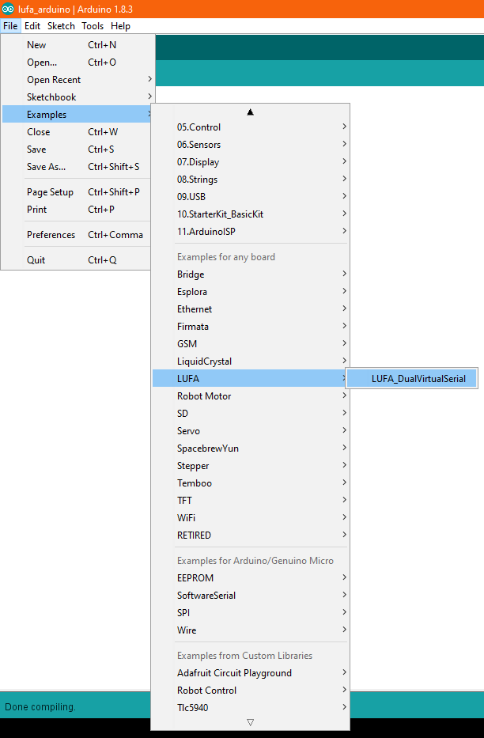
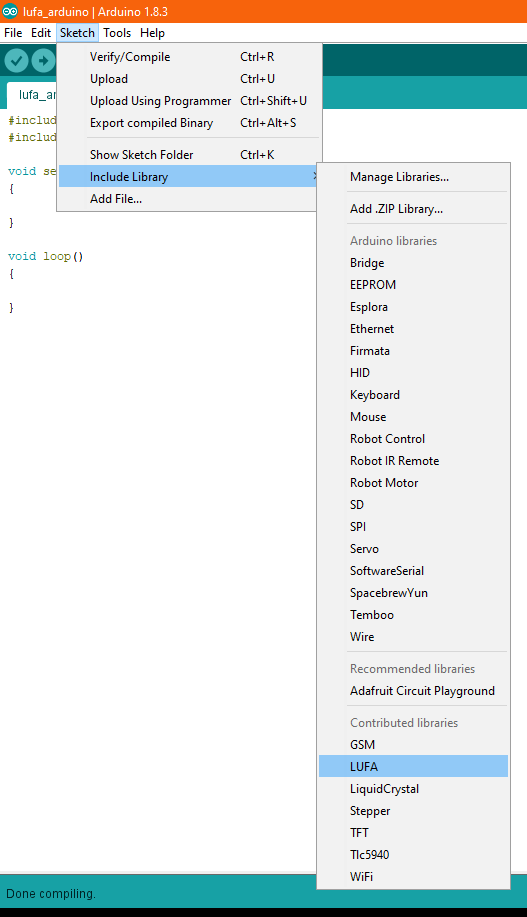

# Arduino-Lufa

=========================

LUFA (Lightweight USB For AVRs) on the Arduino!

## Description

Modern Arduinos ([Arduino Leonardo], [Arduino Micro], [Arduino Esplora], [Arduino Lilypad USB], and the Upcoming [Arduino Tre]) came with a ATmega32u4 which have a native USB interface on the MCU. The Arduino IDE also came with a tiny USB stack that has a USB CDC Serial, a Keyboard, and a Mouse. It might be enough if you're migrating old projects (form ATmega168/328's) to the new hardware, but when you want to unleash the full power of it, you'd find that the current implementations lasks extensibility (BADLY!).

Thus, I managed to bring the powerful [LUFA] to Arduino!

[Arduino Leonardo]:http://arduino.cc/en/Main/ArduinoBoardLeonardo
[Arduino Micro]:http://arduino.cc/en/Main/ArduinoBoardMicro
[Arduino Esplora]:http://arduino.cc/en/Main/ArduinoBoardEsplora#.Uv9QRNySzkI
[Arduino Lilypad USB]:http://arduino.cc/en/Main/ArduinoBoardLilyPadUSB
[Arduino Tre]:http://arduino.cc/en/Main/ArduinoBoardTre

[LUFA]:http://www.fourwalledcubicle.com/LUFA.php

## Installation

For the automatic installation, you need to have both git and Python 3.3 (or later) installed. These instructions work on both Linux and Windows.
Alternatively, there are instructions for [manual installation].

1. Close all open Arduino IDE windows!

2. Navigate into your Arduino IDE's `libraries` folder. Replace `<arduino_install_path>` with the install path of the Arduino IDE.

    ```
    $ cd <arduino_install_path>/libraries
    ```

3. Clone both Arduino-Lufa and the LUFA submodule:

    ```
    $ git clone --recursive https://github.com/Palatis/Arduino-Lufa.git LUFA
    ```

4. Install LUFA boards (more on this below)

    ```
    $ ./LUFA/install.py
    ```

5. Done! Proceed with the steps below to try out Arduino-Lufa

[manual installation]:docs/manual_installation.md

## First run and use

To test Arduino-Lufa, open the LUFA_DualVirtualSerial example, select your board type from
the `Tools > Board > Arduino LUFA AVR Boards` submenu and click __Verify__. 
(**Note**: only atmega32u4 based boards are marked as compatible and will appear, if you 
are using another board which should be compatible please open an issue. Also see Note on __Upload__ below)

 Examples -> Examples for any board -> LUFA -> LUFA_DualVirtualSerial"
title="File -> Examples -> Examples for any board -> LUFA -> LUFA_DualVirtualSerial"
/>

To use Arduino-Lufa, include it as a library in your sketch:

 Include Library -> Contributed Libraries -> LUFA"
title="Sketch -> Include Library -> Contributed Libraries -> LUFA"
/>

### Note on uploading the LUFA_DualVirtualSerial sketch

By uploading this sketch to the board, you will prevent the Arduino IDE from automatically reset the board before uploading another sketch. This is normally done by setting up a seial connection with 1200 baud, connecting, then disconnecting.

You can, however, manually reset the board by pressing the hardware reset button when the upload starts. To better see this, enable "Show verbose output during upload" in your preferences and wait until the IDE repatedly prompts something like this:

```
PORTS {COM1, COM5, COM6, } / {COM1, COM5, COM6, } => {}
```

If done correctly, the LED on pin 13 will begin flashing and you'll see the upload progressing in the console.

This is not permanent, however. To go back to the original state, upload a sketch compiled without Arduino-Lufa, as explained below.

## Deactivating Arduino-Lufa

If you need to compile sketches that use the Arduino Core USB Stack, you'll need to select the board type from
the `Tools > Board > Arduino AVR Boards` submenu.

If you used the `activate.py` script to change the main core files (legacy method), then you'll have to deactivate
LUFA like so:

```
$ ./<arduino_install_path>/libraries/LUFA/deactivate.py
```

Uninstalling the LUFA AVR Boards can be done like so: 

```
$ ./<arduino_install_path>/libraries/LUFA/uninstall.py
```

or simply by deleting the `./<arduino_install_path>/hardware/arduino-LUFA` folder.

If you work with a lot of different boards and find switching tedious, it is recommended to use the `install.py` script
so that you can always switch to and from LUFA by selecting the Arduino board from the relevant submenu.

## Credits
* Victor Tseng: palatis _AT_ gmail _DOT_ com (Original Author)
* Daniel Korgel (Contributor)
* Felix Uhl (Contributor)
* CrazyRedMachine (Contributor)
* Arduino: http://arduino.cc
* LUFA: http://www.fourwalledcubicle.com/LUFA.php

## Copying
    The MIT License (MIT)

    Copyright (c) 2014, Victor Tseng

    Permission is hereby granted, free of charge, to any person obtaining a copy
    of this software and associated documentation files (the "Software"), to deal
    in the Software without restriction, including without limitation the rights
    to use, copy, modify, merge, publish, distribute, sublicense, and/or sell
    copies of the Software, and to permit persons to whom the Software is
    furnished to do so, subject to the following conditions:

    The above copyright notice and this permission notice shall be included in
    all copies or substantial portions of the Software.

    THE SOFTWARE IS PROVIDED "AS IS", WITHOUT WARRANTY OF ANY KIND, EXPRESS OR
    IMPLIED, INCLUDING BUT NOT LIMITED TO THE WARRANTIES OF MERCHANTABILITY,
    FITNESS FOR A PARTICULAR PURPOSE AND NONINFRINGEMENT. IN NO EVENT SHALL THE
    AUTHORS OR COPYRIGHT HOLDERS BE LIABLE FOR ANY CLAIM, DAMAGES OR OTHER
    LIABILITY, WHETHER IN AN ACTION OF CONTRACT, TORT OR OTHERWISE, ARISING FROM,
    OUT OF OR IN CONNECTION WITH THE SOFTWARE OR THE USE OR OTHER DEALINGS IN
    THE SOFTWARE.
